# Intro
- Introduce ourselves 
- For this lesson we will be using a pre-built game that you can all download
- Today we will be covering how to make a score display, a game over screen with a restart button, and a main menu. 
- Three majors ways of doing UI and reasons for them
    - Prefab
    - Multi-scene

# Part 1 - Score Display
- Start by going over to the Hierarchy pane right click → UI → Text - TextMeshPro
- Import TMP essentials if it asks
    - Don’t use Text! It isn’t as versatile as TextMeshPro
- In the hierarchy, notice that our text object is a child of a Canvas object. All UI elements should be children of the canvas and we just saw that creating a UI element also creates the canvas if one doesn’t exist yet. 
- The canvas has 3 render types
    - The default overlay is put on top of the scene and changes based on the screen
    - Camera is in front of the camera and changes based on the camera
    - World space behaves like other objects and can be placid in front of or behind other objects using the 3D coordinates
- The default overlay will be sufficient for our purposes
- Double click the new text item to view it easily
- Rename the Text item as Score. Leave Canvas named as such
- Change the anchor point to the top-left corner of the canvas
- Set X and Y coordinates to (100, -25)
- Under the TextMeshPro area of the Score item, set the text to “Score: “
- You can also change the font style, font size, and vertex color here
- Open up the GameManager script and update it to the following:

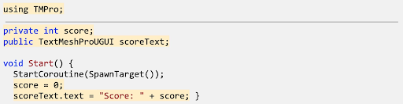
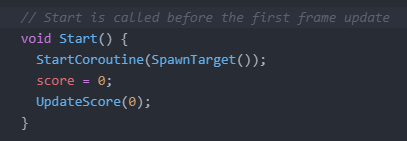
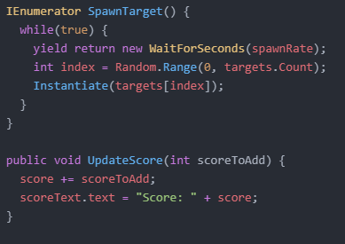

- Select your Game Manager object in the Hierarchy panel and drag te Score object from the Hierarchy into the Score Text box that you see in the Game Manager Script inspector
- With this we now have a way to dynamically update the score text we made. Now we just need to actually use it.
- Go over to the Target.cs script. We will add the following to give the different blocks a point value and prepare to use the GameManager.cs

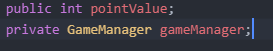

- Next go to your prefabs and you should see pointValue in the script area of the inspector. Type in 5 for the three good blocks and -5 for the bad block. This gives each of our blocks a point value that is independent of each other and easy to change.
- Next let’s go back to Targets.cs and have the score update.

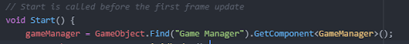
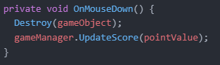

- Now when you click a block, the score changes by that blocks point value
- Great! Now we have a dynamic score display!

# Part 2 - Game Over Screen
- The game over screen can be done in the same scene, but for this tutorial, we’re going to make a separate scene for it and will show how a global scene transitioner can be created
- Start by going to File -> New Scene and save this new scene as Game Over in the Scenes folder
- Right click in the Hierarchy panel and go to UI →  Test - TextMeshPro
- Name this new text element Title and change the text to “Game Over”
- You can also change the font, color, etc. if you wish
- You’ll notice that the textbox isn’t wide enough to have this in one line So we will set the alignment to center and disable wrapping
- Then move the text to position (0, 48) and increase the font size to 60
- Now we will create a button that will allow us to restart the game. Right click the hierarchy panel and go to UI →  Button - TextMeshPro
- This has more functionality than the regular button just like Text vs. Text - TextMeshPro
- Rename the button Restart Button and set the position as -20
- In your Hierarchy panel you should see a Text (TMP) as a child of our new button. This is a text element like we’ve dealt with before so go ahead and use it to make the button say Restart
- Now to add functionality to this button we are first going to create a new object to manage our scene transitions. Right click in the Hierarchy panel and go to → Create Empty
- Rename this new object as Scene Loader and a script component to it. Create a new script called SceneLoader.cs
- Open up the new script and add the following:

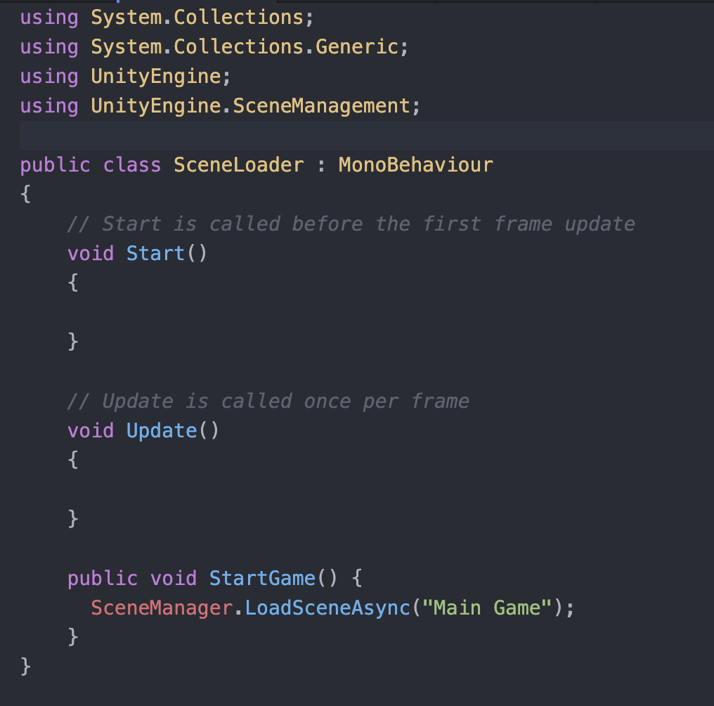

- Now that we have a function to perform a scene transition, we just need to connect it to our button
- Select the Restart Button and look in the inspector window for a Button section. In this section click the plus under the On Click () area
- Drag the Scene Loader object into the bottom left box. Then in the top right box go to SceneLoader → StartGame ()
- Go to File → Build Settings and click Add Open Scenes to add the Game Over Scene. Switch to the Main Game scene and repeat this
- If you click the play button when in this Game Over scene you should be able to go to the main game by clicking the Restart button
- Now our StartGame() function will be called by the button, but we still need the main game to send us to this screen in the first place. 
- Go to your GameManager.cs script and update it with the following:

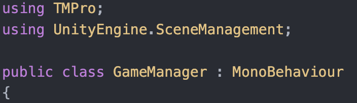
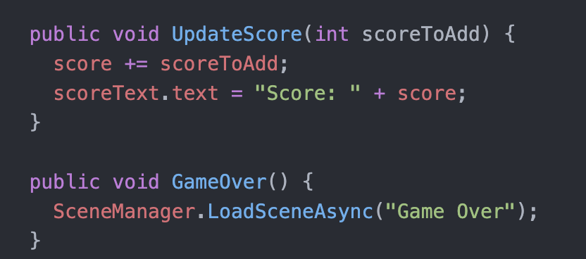

- We want to go to the game over screen when a good block falls below the screen. In order to do this we will make what’s called a tag
- In the Project panel, navigate to Assets > Prefabs and select the Bad 1
- In the inspector go to the Tag dropdown and hit Add Tag at the bottom
- Click the plus under the first area and save the name “Bad”
- Then reselect the Bad 1 prefab and go to the Tag dropdown again. This time you should see Bad as an option which you should select
- Then go to the Target.cs script and update the OnTriggerEvent function:

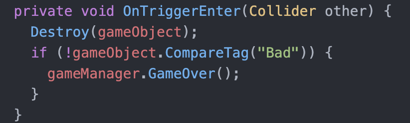

- Now if a skull drops below the screen, the game should keep going, but if a good block goes below you should see the Game Over screen. Furthermore, the Game Over Screen should successfully restart the game

# Part 3 - Main Menu
- Now it’s a little strange to be thrust into the game as soon as you start up the application. So we are going to create a main menu.
- Start by opening up a new scene and saving it as “Main Menu”
- Right click in the Hierarchy pane and click → UI → Text - TextMeshPro and rename this as Title
- Change the text itself to be Crates and the position to (0, 0)
- Change the color, font, and size if you wish
- You may have to disable wrapping to get the Title on one line
- Now let’s create some buttons to choose the difficulty for our game
- Right click in the Hierarchy pane and click → UI → Button - TextMeshPro
- Change the name to Easy Button and its text to Easy. 
- Change the size if you wish
- We’ll also reduce the width to make the button look nicer and move it to the left.
- In the Hierarchy panel click the button and hit Ctrl-D twice to duplicate it twice
- Select the new buttons in the Hierarchy pane and change the position so that all of our buttons aren’t overlapping one another. 
- Change the name and text of the new buttons to Medium Button and Medium for the second one and Hard Button and Hard for the third
- Next we are going to go to our Game Over scene and make some changes to our Scene Loader object
- First go into your SceneLoader.cs script to add a difficulty variable and update the Start() and StartGame() functions:

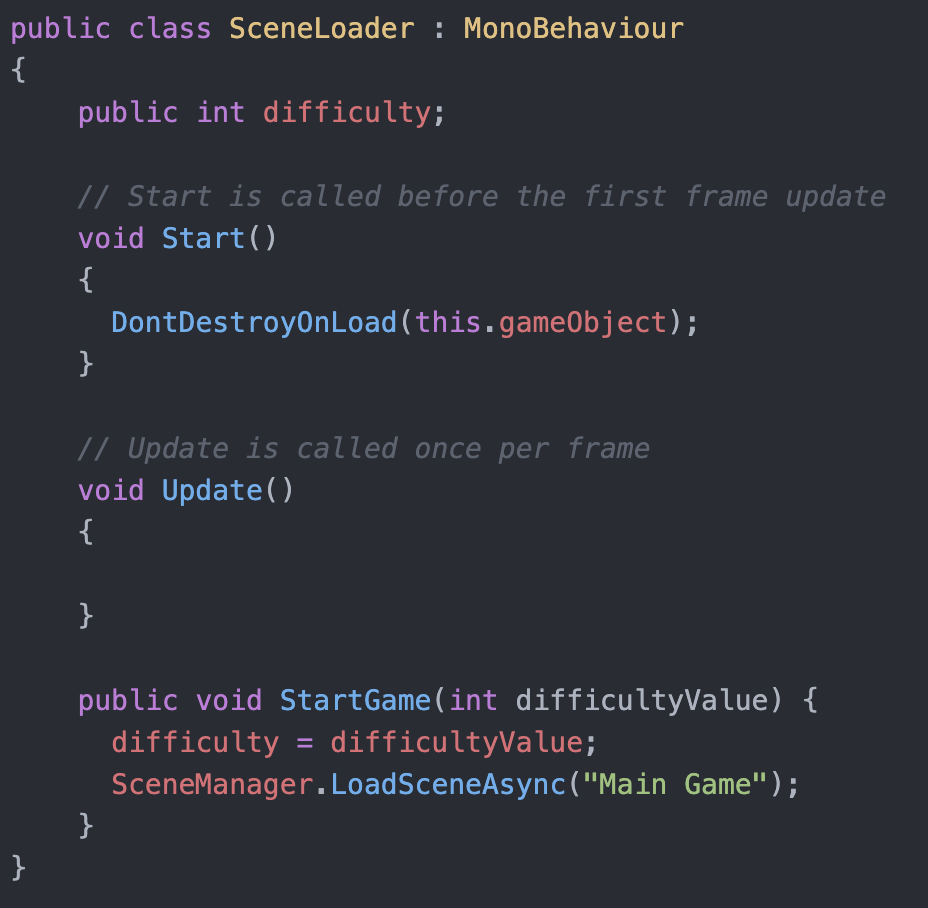
 
- The DontDestroyOnLoad will make it so that our Scene Loader game object will persist through different scenes. Through this we can transfer the difficulty value between scenes
- In the Project panel navigate to Assets > Prefabs and drag the Scene Loader from the Hierarchy panel to the Project panel
- Then delete Scene Loader from the Hierarchy and then drag the new prefab to the Restart Button’s On Click event. Don’t forget to reselect the StartGame(int) function too
- Go back to the Main Menu scene and add this new prefab to the Hierarchy
- Create a DifficultyButton.cs script and attach this to our three difficulty buttons
In this new script:

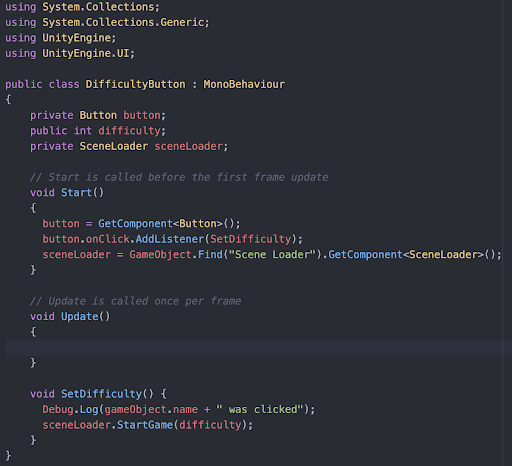

- Go to the inspector for each of the buttons and you should see a difficulty field in the script section. Assign Easy a difficulty of 1, Medium 2, and Hard 3
- Now if we click the play button from our Main Menu scene, we should be able to play the game and still use the restart button on the Game Over screen
- A message should appear in the console telling you which button you pressed too
- However, we aren’t actually changing the difficulty yet
- Go to your GameManager.cs script and add a difficulty variable and update the Start() function:
 
 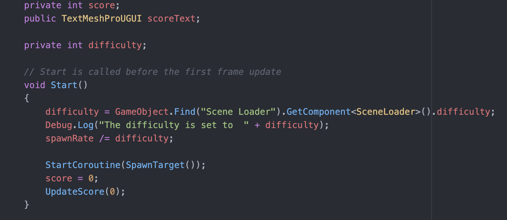
 
- Now you should have buttons that change the difficulty for the game and restarting the game will put you at the same difficulty too
- A message should also appear in you console log that says what the difficulty is set to

