# Intro
Welcome back everyone. Last time we created a score text that changes as you play the game, a game over screen with a working restart button, and a main menu. Today we will show off another example of what you can do with UI elements and introduce you to a few more we have yet to show you. 

# Part 4 - Inventory System
Sources: Brackeys from YouTube and Ahninniah from the Unity Asset Store
Intro:
This tutorial is going to cover ways to pause in Unity and is also going to involve using the UI grid layout component. We are going to be using a prebuilt game that already includes player movement, item interaction and an inventory. This inventory, however, has no representation visually and the HeldItem child object of the player can’t have any items assigned to it in the game’s current state.

- Create Pause script called "Pausing"
- Choosing what and what not to disable can vary depending on the game, but here are a few things to keep in mind:
- Disabling objects by tag can be difficult, because objects can be re-enabled directly using a tag
- Things like the player controller are obvious, but keep in mind other objects’ operations that will be running
- In the case of larger games, using parent objects is the best way to go about this

- Luckily, for this tutorial, we’re only concerned about restricting player control while pausing, which means retrieving and disabling the MoveView and PlayerMovement scripts according to a boolean value

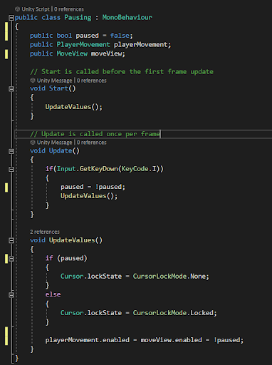

- The cursor is set to be locked and invisible in the middle of the screen at startup by the MoveView script, but to allow it to be used on the pause screen, we’re going to be changing that variable based on the boolean as well
- Cursor Lock States: None, Locked, Confined

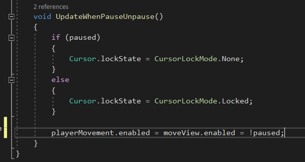

- We’ll then put this script in the GameManager object and assign its public variables:

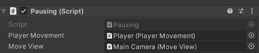

- Now we’re going to start setting up the menu the player will be able to interact with
- Talk about setting canvas
    - We’re going to briefly cover some panel and canvas attributes in Unity and some common beginner pitfalls
    - How to anchor panels by place on screen rather than dimensions to have consistency across aspect ratios
    - Different Render Modes
        - Screen space - scene
        - Screen space - camera
        - World space
    - Canvas Scaler
        - Is “Constant Pixel Size” by default
        - Screen match mode: match width or height
        - Have slider dragged to height and why we want this

- In the Canvas object, we’re going to create an empty game object called PauseMenu. This is going to house all of the UI elements we’ll see when pausing
    - Is going to be anchored to center

- We’re going to add a small panel as a child of PauseMenu with a TextMeshPro child object that will indicate that this is an inventory menu (Called TitlePanel)
    - Is going to be anchored to center

- In the PauseMenu object, we’re going to create a UI>Panel object as its object that will be called InventoryGrid and will be sized according to the values in my final game
    - Is going to be anchored to center
    - In this game object we’re going to add a Grid Layout Group component which is a quick, easy way to format UI that has things like repeating buttons or displays
    - We’re going to briefly go over some of the components of the Grid Layout component
    - We’re then going to create a child of this InventoryGrid called InventorySlot that is a Button
    - We’re going to create a button object as a child and then turn it into a prefab and copy it to show some of the properties of the Grid Layout Group
    - We can drag this object into the assets window to turn it into a prefab, as we’re going to be manipulating multiple copies of this and will want to make changes that extend across all of those copies

- We can add and use a placeholder image to get the dimensions of this image looking nice inside the button, as this is where the image of the item in this slot is going to be displayed
- Make sure to click “preserve aspect” in the image settings
- We’re now going to create a script called InventorySlot to define the behavior of this object
- Firstly, since we’re going to be referencing the Image component in this script, we’re going to have to put “using UnityEngine.UI;”

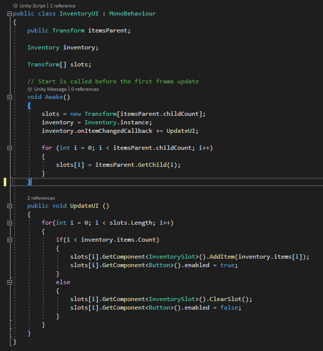

- This script is going to use a small amount of Image component functionality, but we’re going to do more once we attach it to the object
- The “Item” object I’m referencing in this script is a kind of unity object called a “scriptable object”. It allows for instances of objects that hold similar values to be created. In this case, the “Item” scriptable object is one I created for this tutorial that holds all of an item’s data such as the icon or name

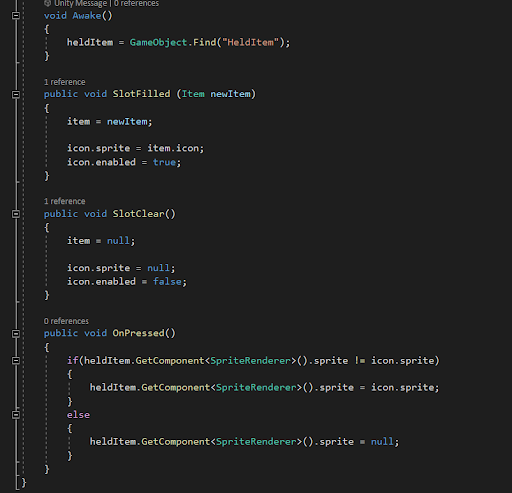

- We’re going to attach this script to the InventorySlot prefab, and then add the image component that this code references
- This script is also going to be interacting with the Button component, so we’re going to place OnPressed() into OnClick() in the inspector
- The inventory menu can now be seen while playing the game, but it covers the screen regardless of whether the game is paused or not
- We’re going to go back into the Pausing script in GameManager to add a reference to the InventoryMenu object and some lines of code that’ll enable/disable it based on the paused boolean

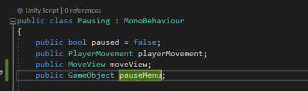

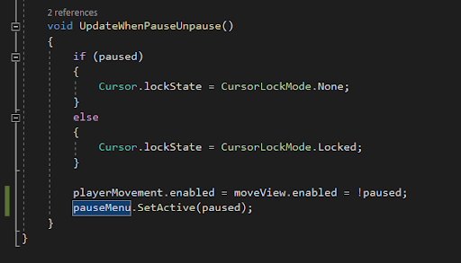

- We can now assign the new pauseMenu variable in the inspector
- Our final script of this tutorial is going to be the InventoryUI script which is going to be placed in the PauseMenu game object

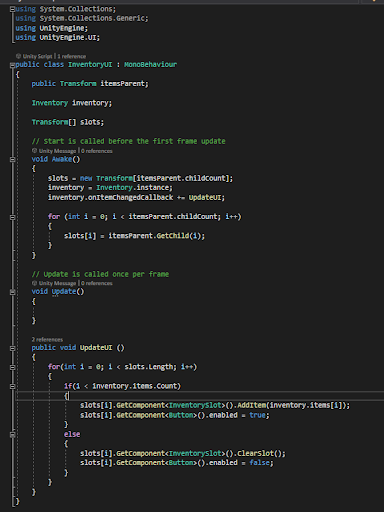

- This script is also going to be using the Unity UI package

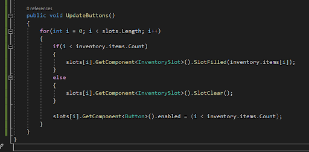
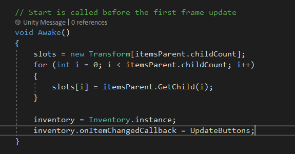

- This is going to involve discussing the inventory script logic and how we can use it to be displayed by the UI
- We can then add this script to be a component in the PauseMenu object
- We then will assign InventoryGrid as the itemsParent variable in the inspector
- We can now go back to the pause menu one last time and have the InventoryUI script run the UpdateUI method every time the I button is pressed

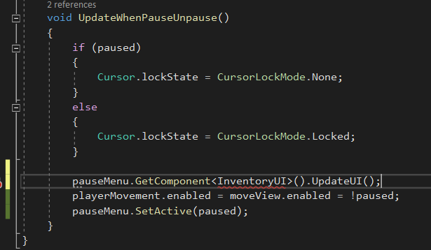

- And we’re done!
- If time permits, I’ll answer questions and go over some of the more specific workings of the base game components
