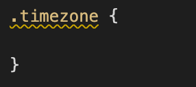

## Task 4: Styling your buttons 

#### Now that you've styled your text and your clock, now's time to make any changes to your radio buttons that you'd like.

Lastly, you'll define a timezone selector to style the labels and buttons used for your timezone selector.  Similarly to the way you defined the clock styles using the unique id from the clock div, preceded by a '.', you'll define the radio button style class using whatever class you used to group together your timezone buttons. I grouped my radio buttons and labels in a div with the class set to `"timezone"` so my CSS file looks like this:

If you're already satisfied with how your page looks because of how you styled the body, then this part is unnecessary, but I recommend you do some styling here to get a better hang of CSS attributes.

#### Open a pull request for your code

Once again, be sure create a new branch, titled `[your GitHub username]-[week]-[task number]`, for your task.  

After you've created your branch, commit your code to this branch and open a pull request to merge with your main branch.  

As long as there are no conflicts with the base branch, you can now merge your pull request with your main branch. This is the last task for week 2, so you're all done! 