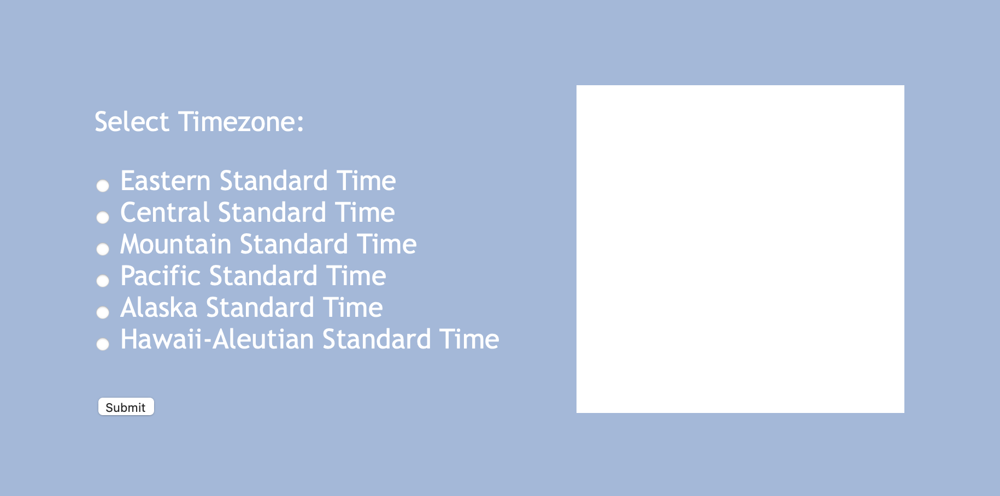
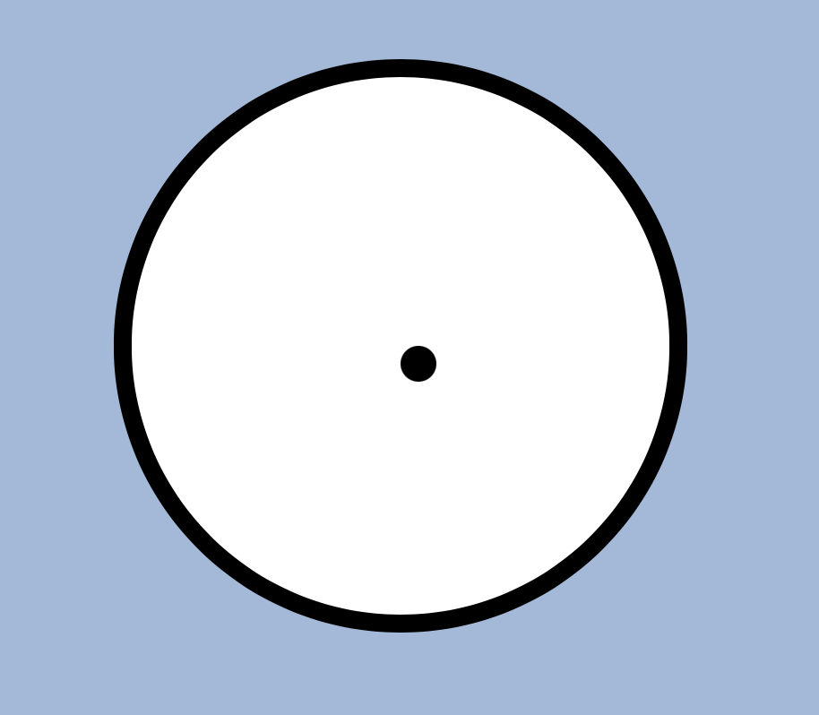
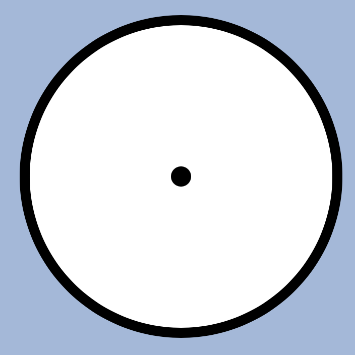

## Task 2: Building the background of your clock

#### In this task, we'll cover some tips and tricks to get your clock shaped and positioned correctly on your page.

Inside of your HTML file, make sure you have a div with its class set to `"clock"`.  This div should be defined after your form ends, but still inside the body tags.

Once you've established your clock div, move to your `style.css` file and define a block for `.clock`.  This will affect all elements with class = "clock"; therefore, the div we just defined.

First, you'll want to set the height and width - it doesn't matter what you set them to, as long as they are the same value.  I set my height and width to both be 300px.  You'll also want to set a background color for your clock that differs from the background of the screen so that the clock is visible.

If you load your HTML at this point, it should look something like this (give or take depending on what you've set your attributes to):

Since we want our clock to be round, we'll set the `border-radius` in the `.clock` section to 50% - this will completely round the edges of the square, thus making it a circle. You may also want to add a border to the clock to make it look more familiar.

Lastly, be sure to set the position of the items in this class to relative.  This will help us glue together the elements we're going to place on top of the clock.

Next, use the after selector on your clock class to define a new block like so:

`.clock::after{}`

This will create a new element associated with the clock class that we're going to use to design a small button that will sit in the middle of the clock, on top of where the hands are going to overlap..

First, set the position to absolute so that this element is anchored to the circle we have on the page. Next, set content to `''` - this will make sure nothing is printed inside this small block.

You'll also want to set the height and width to be a small square - I've set mine to 20px - and change the border-radius to 50%, just as we did with the base of the clock, to make it a circle.

Next, set the top to 50% and the left to 50% to move the small circle to the center of the clock. 

If you load your page now, you'll notice that the small circle is slightly off center:

This is because the object is aligned with its position relative to the left and top sides, not its center.  To fix this, enter the following line into the `clock::after` block, below where you set the top and left positions:

`transform: translate(-50%, -50%);`

This will translate the item 50% of its width to the left, and 50% of its width upwards.  Now your clock should look like this:

#### Open a pull request for your code

Once again, be sure create a new branch, titled `[your GitHub username]-[week]-[task number]`, for your task.  For reference, my username is `danzelo1` so my branch would be titled `danzelo1-3-2` for this task.

After you've created your branch, commit your code to this branch and open a pull request to merge with your main branch.  Be sure to title and comment your pull request appropriately.

As long as there are no conflicts with the base branch, you can now merge your pull request with your main branch. From here, click on "Issues" on the top left of your screen, below the name of your repository, and click on the week (week 3). A new comment should have appeared for your next task where you'll find the instructions for task 3.