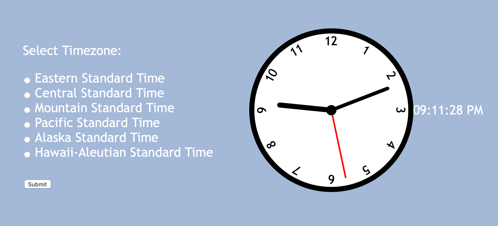
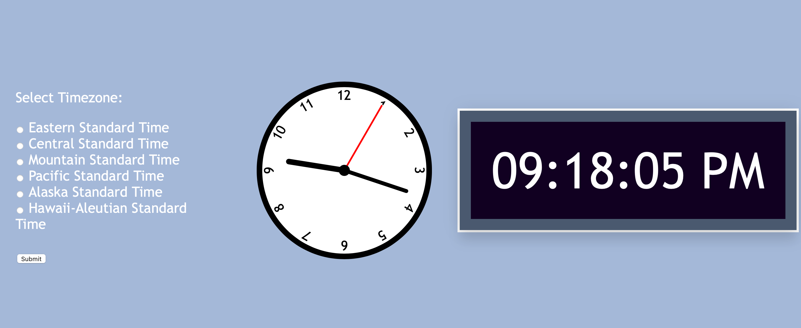

## Task 1: Create a new page with an analog and a digital clock

#### Your final assignment is going to merge everything you've created so far onto a single webpage, and allow the user to choose between a digital clock and analog clock. This first task will help you get all of your code in one place.

- Copy your files from last week into your week 4 folder.  
- Add a div tag below your clock div (below the `
` tied to `
` ).  
  - Make sure to give this tag a unique id attribute, my line of code looks like `

`.

- Copy the function you wrote for your digital clock in week 2 to show the time.  
- Paste the contents of this function into the function that sets the analog clock so that both clocks are set with a single function call.  

Be sure to rename any repeating variables if necessary to get the function working.  Also, make sure to change the code you use to print the time to search for an element with `id="digital clock"`, so my line of code looks like `document.getElementById("digital clock").textContent = time;`. 

At this point, your page should look something like this:

- Add a selector in your css file that selects the `"digital"` class like so:

`.digital {}` 

You may choose to style your digital clock differently this time, but if not, feel free to copy the code from week 2's CSS file in the `.clock` section and paste it into your `.digital` section.

Your page should now look something like this:

Feel free to size down the digital clock so that it doesn't mess up your layout when you resize your screen.

#### Open a pull request for your code

Once again, be sure create a new branch, titled `[your GitHub username]-[week]-[task number]`, for your task. For example, my username is `danzelo1` so my branch would be called `danzelo1-4-1` for this task.

After you've created your branch, commit your code to this branch and open a pull request to merge with your main branch.  Be sure to title and comment your pull request appropriately.

As long as there are no conflicts with the base branch, you can now merge your pull request with your main branch. From here, click on "Issues" on the top left of your screen, below the name of your repository, and click on the week (week 4). A new comment should have appeared for your next task where you'll find the instructions for task 2.