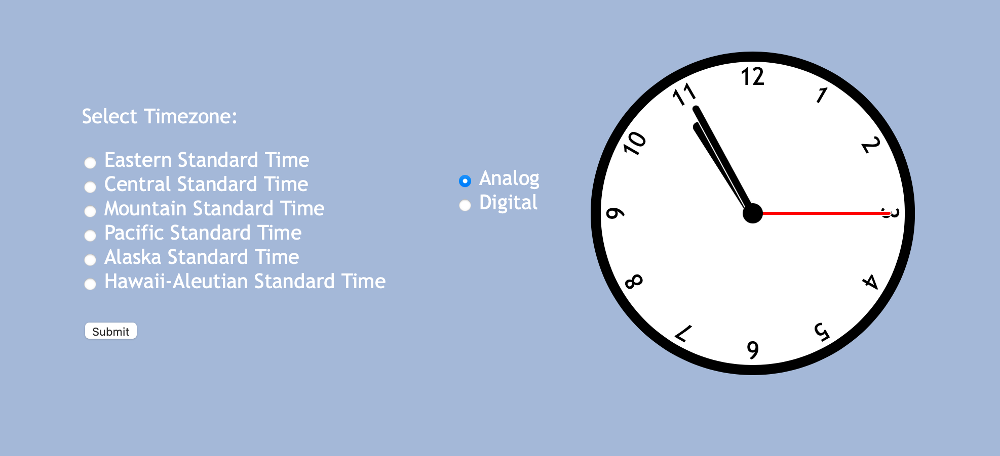
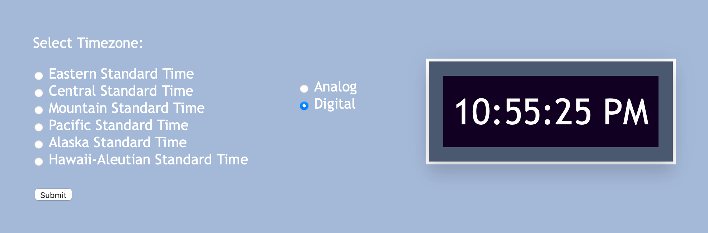

## Task 3: Toggling between a digital and an analog clock

#### Now that we have the page all set up, all that's left to do is to get our code to do what the webpage says! This task will go over some JavaScript functions using methods you've learned previously.

In your JavaScript file, define two functions - one called `setDigital()` and another called `setAnalog()` .  Inside of each of these functions, use `document.getElementById()` to define 2 variables that select the analog clock and the digital clock.  So, your code for the digital clock would look like this:

`var digital = document.getElementById("digital clock")` 

because my digital clock data is linked to a div tag with `id="digital clock"`.  Now, do the same thing for a variable that holds your analog clock data (if you copied your code from week 3, the id for your analog clock should be `"clock"`).

Next, we're going to use these variables to change their display so that only one will be shown at a time.  In `setAnalog()`, set `analog.style.display` to `"flex"` so the code should look like:

`analog.style.display = "flex"`

Similarly, set the digital clock object's display to `"none"`.  This code will override the current CSS display settings to hide the digital clock and hide the analog clock.

Use the same methodology to hide the analog clock and show the digital clock in your `setDigital()` function.

Finally, we just have to link these functions to the radio buttons.  Back in your HTML code, add the `onclick` attribute to both input fields.  In the input field for the analog clock, set this attribute to `"setAnalog()"` , and. by the same logic, set the digital clock button's `onclick` attribute to `"setDigital()"`.  This is the same way we linked a function to the submit button, so feel free to refer to that code for help.

Now, if you click the "Analog" button, your screen should look like this:

And if you click the "Digital" button, it will look like this:

However, you may notice that when you first load your page, both clocks appear.  To fix this, add the `checked` attribute to the input field tag for the analog clock's radio button so that this button will be selected when the field loads.  Then, in your JavaScript file, call the `setAnalog()` function after it's defined.

#### Open a pull request for your code

Once again, be sure create a new branch, titled `[your GitHub username]-[week]-[task number]`, for your task.

After you've created your branch, commit your code to this branch and open a pull request to merge with your main branch.  Be sure to title and comment your pull request appropriately.

As long as there are no conflicts with the base branch, you can now merge your pull request with your main branch. From here, click on "Issues" on the top left of your screen, below the name of your repository, and click on the week (week 4). A new comment should have appeared for your next task where you'll find the instructions for your fourth and final task.