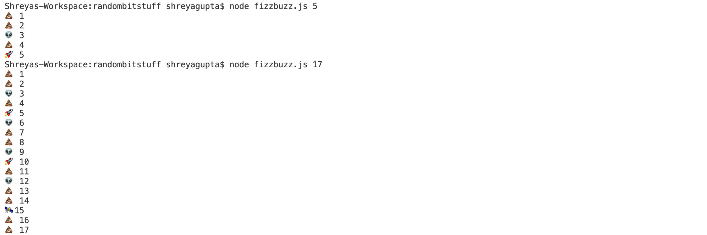

## FizzBuzz In SPACE

*For this assignment, you will follow the instructions and complete a task showing your knowledge of the subject at the end. If at any moment you need help, feel free to contact your TAs.*

### :airplane: Starting off

Create a file called fizzbuzz.js

**FizzBuzz**

FizzBuzz is a program used to demonstrate basic functionality of a language, often when switching between programing languages or as an introduction (that's us!) to first learning a language.

The goals of the program is to go through the numbers from 1 to 100 and print "fizz" whenever a number is divisible by 3, print "buzz" when it's divisible by 5, print "fizzbuzz" when it's divisible by both 3 and 5, and print the number when it's not divisible by either. For our program, you will do something very similar:

For the numbers from 1 to 100:
* print 👽 and the number if it is divisible by 3
* print 🚀 and the number if it is divisible by 5
* print 🛰 and the number if it is divisible by both 3 and 5
* print 💩 and the number if it is not divisible by either 3 or 5

Tip: copy paste the emojis to get it into your code!

### Help:

* [Loops in Javascript](https://www.w3schools.com/js/js_loop_for.asp)
* [Conditions in Javascript](https://www.w3schools.com/js/js_if_else.asp)
* [Command Line Arguments in Javascript](https://nodejs.org/en/knowledge/command-line/how-to-parse-command-line-arguments/)
* [console.log Method](https://www.w3schools.com/jsref/met_console_log.asp)


### :pencil: Commenting your Code

Use in line comments to explain how your code works. Commenting your code helps ensure that you understand what is happening, and helps the code reviewer read through your code easily. For example:

**Great example:**
```
var i; // Initialize a variable
for (i = 0; i < nums.length; i++) { // Initialize a for loop that iterates from 0 to length of the nums array
  nums[i]+5; // At every iteration, add the i-th integer in the nums array to the text variable
} // End of loop
```

When you start writing more code (200+ lines) you will want to do the next example. For this course, your code should not extend past 50-100 lines and we want to use your comments to see how well you understand the concepts and language, so it's better to use the previous example.

**Okay example:**
```
// This code uses a for loop to iterate through the entire nums array and add 5 to each element
var i;
for (i = 0; i < nums.length; i++) {
  nums[i]+5;
}
```

**Don't do this:**
```
// Add 5 to all values in nums array
var i;
for (i = 0; i < nums.length; i++) {
  nums[i]+5;
}
```

### :red_car: Running your Code

1. Save your file
2. Make sure you're in the same directory in which you saved your fizzbuzz.js file

In this program, you need to allow your program to take a second argument, so:
3. To run your fancy new program, type: ```node fizzbuzz.js``` with an integer between 1-100 in terminal

### :pencil2: Testing

To test your code, run it with different integers in the program argument to see what happens.

**Test Case 1:**

If you run ```node fizzbuzz.js 5``` the output should be:

```
💩 1
💩 2
👽 3
💩 4
🚀 5
```

**Test Case 2:**

If you run ```node fizzbuzz.js 17``` the output should be:

```
💩 1
💩 2
👽 3
💩 4
🚀 5
👽 6
💩 7
💩 8
👽 9
🚀 10
💩 11
👽 12
💩 13
💩 14
🛰 15
💩 16
💩 17
```

**Output example:**



### ✅ Submit

**Task 1: Complete the FizzBuzz program as described above**

Commit a file called fizzbuzz.js

Good job, you're fizzing and buzzing in space!
