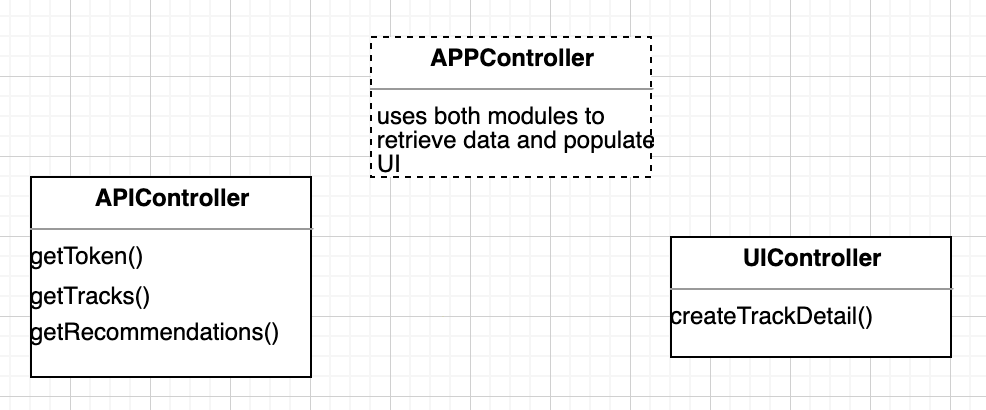

## Overview

Login to Spotify's developer dashboard [here](https://developer.spotify.com/dashboard/login). Then press **create an app**. Give it a cool name and press **Create**!

Click into your app and record the **Client Id** and **Client Secret**. 

<br/>
<br />

Before the actual programming, here's a quick overview of how the project is structured. We're going to be using the **revealing module pattern** in javascript, which kind of mimics **classes** in OOP languages like Java. 

<br />

Watch [this video](https://www.youtube.com/watch?v=pOfwp6VlnlM), which gives a brief overview of this concept.

<br />
<br />

Let's take a look at an example of a module:


Notice that there are parentheses around the function– this indicates that it is an **expression** and should be evaluated first. So remember:

The **first** set of parentheses evaluate the function.

The **second** set of parentheses call the function.

So, the function is essentially declared and run immediately. This is called an **IIFE**, or immediately invoked function expression.

```js
const car = (function(){
  var speed = 100;
  return {
  	forward() {
      speed += 1;
    }
	}
})();
```

<br />
<br />

Notice that because the variable `speed`  was declared within this function, it acts as a **private** variable and can't be accessed outside of the function. However, returning the method `forward` allows us to change the value of speed indirectly. **Important! All methods/variables are private unless included in the return object**. This is how modules enable us to **encapsulate** private variables or methods and reveal other ones through returning them.

```js
//doesn't work!
car.speed = 101;

//works
car.forward();
```

<br />
<br />

Also notice that the method `forward`  does not exist globally. It must be called with a reference to `car`. This encapsulation is what will really make it feel object-oriented, with this example having an object-private field and an object-public method.

```js
//doesn't work
forward();

//works
car.forward();
```

<br />
<br />

Essentially, just remember that modules:

- keep all variables and methods private unless explicitly revealed(in return)
  - prevents variables from polluting global scope
- are IIFEs- so they must be declared with function expressions and two sets of parentheses

<br />
<br />


For more reading, check out [this](https://addyosmani.com/resources/essentialjsdesignpatterns/book/#revealingmodulepatternjavascript) excerpt on the revealing module pattern, as this is not a natural javascript concept if you're new to object-oriented programming.

<br />

In this project, we're going to have two separate modules that handle distinct concerns– one called `APIController` for handling API calls and the other called `UIController` for handling our HTML input fields. A third module, called `APPController`,  will handle retrieving and displaying the data. Each module will have public methods that the `APPController` will call.



<br />
<br />

To get started, create a new js file called `Song.js` . I've already declared `APPController`  for you. Finish writing the function expressions for `APIController`  and `UIController`. 

```js
//look at the above example and the APPController declaration for syntax
//both API and UI modules take in no parameters

//spotify api call
const APIController = ??

// UI Module
const UIController = ??

  
const APPController = (function(UICtrl, APICtrl) {

})(UIController, APIController);

```


