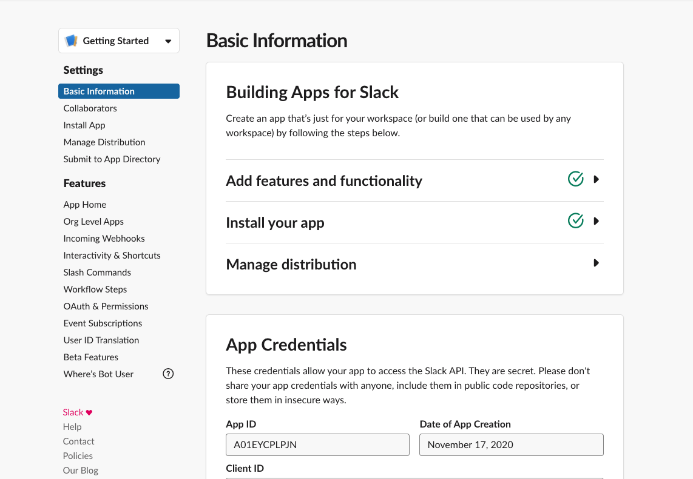
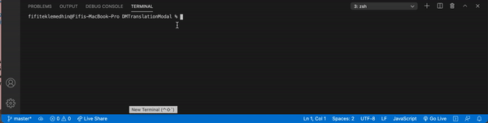
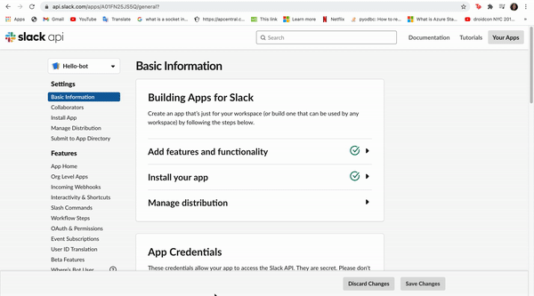
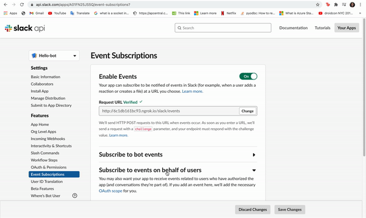
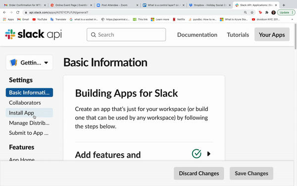
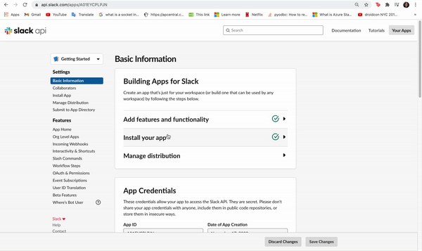

## Config Setup and Event Listeners

#### Setting up a text editor and using event listeners.

Now that you have done some research on Slack development, its time to get building! In this issue, you will learn how to set up a Slack app.

## Installing a Text Editor

Since your slack app will be runing locally, you will need a place to store and edit your code. You can create a folder anywhere within your file system for this project. If you do not have one already, it is highly reccomended that you download an IDE or text editor. This will give you a better interface for when you program, helping you to notice errors and run your code efficiently. Some good editors include [VSCode](https://code.visualstudio.com/download) or [Atom](https://atom.io/).

## Creating a Slack App

In order to create the app, you will need to [create a Slack account](https://slack.com/get-started#/create) and then make a [make a new app](https://api.slack.com/apps?new_app=1) on the developer platform. Once you have made the app, you should be able to click on it and navigate to a page similar to the one below:




## Installing Ngrok

You might be wondering how your local code connects to the slack app. This process happens through a public facing url, or a server connection from your computer to the app. In order to make a public facing url, you first will need to [install ngrok](https://ngrok.com/) , which dedicates a server on your end to receiving requests from the slack app. 

Open a the folder for your slack app in your editor, then open a terminal page. A terminal is a text interface for your computer's operating system. Type in ```pwd``` and press enter to make sure that you have navigated to the folder you created for the slack app. If you have not, refer to [this website](https://medium.com/@grace.m.nolan/terminal-for-beginners-e492ba10902a) on how to change folders. 

Afterwards, refer to the [following tutorial](https://ngrok.com/) on installing ngrok. 


## Connecting to the Slack App

Now that you have installed and ran ngrok, you can connect your local code to your app. Copy the ```forwarding link``` of the running server, then navigate to the ```event subscriptions``` page in your app menu. Enable events, then copy and paste your link in the 'Request URL' field, followed by /slack/events. If your URL is not verified, try running ngrok again and using the new link.





### Event Subscriptions

You have a connection, but the slack app still does not know what type of information to send you. One type of information is an event, which basically means when something happens. In the next issue, you will make a bot that needs to know when someone messages a specific word, like 'hello'. 

Click on 'Subscribe to bot events', and select ```message.channels```, ```message.groups```, ```message.im```, and ```message.mpim```. All of these events listen for a posted message. Click save and then move on:


  

### Access Credentials

The first thing you need to do is link your program to your app! The two pieces of information you'll need to do this are a **slack bot token** and a **slack signing secret**. Refer to the gifs below to locate each of these properties from the Slack dashboard:





### Scopes

Under OAuth & Permissions, scroll down to the **Bot Token Scopes** field and select **Add an OAuth Scope**. From there, add **chat:write** and install the app to workspace. This will enable your app to write messages in chats.

## Downloading Slack Packages

Now that you have the basics set up, you need to configure your **local app**. This will involve installing packages from Slack. A package is a bundle of various classes and interfaces that enable you to code without starting from scratch. You can download several packages for anything ranging from sending a text to creating graphs. In this issue, you will be downloading the bolt package, which lets you program a slack app more easily.

First call the following command:

```javascript
npm init
```

Click enter for each prompt that pops up, then call **ls** in the terminal to list all of the files in your directory. You should have a new file called **package.json**.

Next, you will be saving your bot token and signing secret as environment variables. This step is *extremely* important for two reasons:

1. telling your local environment which slack app it is connected to
2. ensuring that you don't accidentally show sensitive credentials in a screenshot or distributing code

Call the following commands in your terminal and refer to previous instructions on getting the credentials:

```javascript
export SLACK_SIGNING_SECRET=<your-signing-secret>
export SLACK_BOT_TOKEN=xoxb-<your-bot-token>
```

Lastly, use the commands to install the **@slack/bolt** package and create your app:

```javascript
npm install @slack/bolt
touch app.js
```


## 🔔 Events

An important part of the app you just built is a **slack event**. Understanding events will be important as we will be using them throughout the bootcamp. Skim through the following articles to learn more about what an event is in programming, how events are used with the Slack Events API, and types of events that you can use in a project:

* https://www.computerhope.com/jargon/e/event.htm
* https://api.slack.com/events-api
* https://api.slack.com/events


While you're following both tutorials, write down any questions you have (ie what is this dependency, what is a scope). Then, research one of those questions and submit a 2-4 sentence summary of your findings as a comment. 

After you have completed the project, try changing what the app listens for (ie instead of "hello" it checks for "bit camp"). See if there is anything you can't listen for as part of a chat. 

**After you have finished, make sure to commit any file changes you made. To do this, please create a `branch` off of the master called `week(x)` with x being the # of the week you are on. For that week you will need to create a PR for every Learning Lab step to review and make sure your work is correct. For example: After finishing step 1.2, make a new branch off of `week(x)` and call it `week(x)-1.2` (with 1.2 being the step you're on). Then create a `Pull Request` between `week(x)` and `week(x)-1.2`. After reviewing you're PR or having another user review it, merge you're work and continue.**

**REMINDER: If you are part of the MENTORED group, after you complete all steps within a certain week and followed the instructions above, create a `Pull Request` with your work from `week(x)` to `master` and assign your mentor as a reviewer. If you are an open-source user, do the same but self-review your PR to continue to the next week.**
