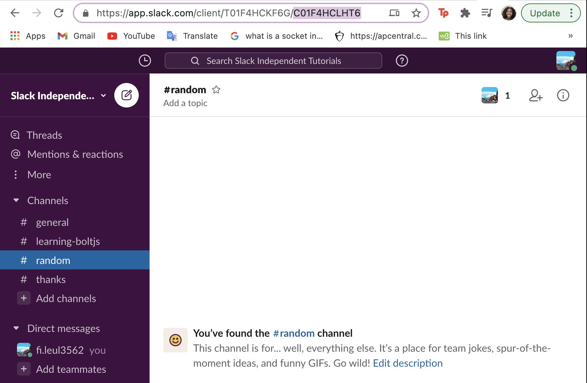

## Creating a Basic Slack App

#### Use what you learned and make your first Slack App.

 You will be building your first app, which is a bot that listens for and responds to specific text in chats. If you are having trouble, refer to [this article](https://slack.dev/bolt-js/tutorial/getting-started#:~:text=%20Getting%20started%20with%20Bolt%20for%20JavaScript%20,handled%2C%20it%E2%80%99s%20time%20to%20set%20up...%20More%20%E2%80%A9https://slack.dev/bolt-js/tutorial/getting-started) as an example of another simple app. Make sure that your app is set up (ie. ngrok is installed and running, )

### Setting up environment variables

The first thing you need to do is select dependencies and access the environment variables you created! Copy and paste the following code to do this:

```javascript
const { App } = require('@slack/bolt');

// Initializes your app with your bot token and signing secret
const app = new App({
  token: process.env.SLACK_BOT_TOKEN,
  signingSecret: process.env.SLACK_SIGNING_SECRET
});
```

You will also be adding this snippet to be notified when the app runs:

```javascript
(async () => {
  // Start your app
  await app.start(process.env.PORT || 3000);

  console.log('⚡️ Bolt app is running!');
})();
```

> **Note:** This will be the boilerplate for most of your apps.


## Events and Scopes

The previous issue went over how to select scopes and events. Choose the scope and event subscription you think fits best for this app. After you are done selecting, make sure that you have saved those subscriptions and installed them to the workspace. 

> Hint: This app will be a bot that listens for and responds to specific text in chats

### Listening for a user

In order to listen for new members, you will need to call app.event() in your javascript file. Here is the boilerplate for the function call:

```javascript
app.event('<your-event-here>', async ({ event, client }) => {
  try {
  
  }
  catch (error) {
    console.error(error);
  }
});
```

Go to the [Slack Events API](https://api.slack.com/events) and find the event for when someone new joins a workspace. Replace the current event in the function call with the event name you found. **Hint:** this should be an event that you have subscribed to.

### Messaging in the channel

Now it's time to create a new channel to remind new members to introduce themselves. To do this, [create a channel](https://slack.com/help/articles/201402297-Create-a-channel) in your workspace and open it up. In your browser URL, you can find the channel ID as the only code starting with a 'C'.



Make sure to save this ID as a **global variable**. To actually message the user, use the following code:

```javascript
const result = await client.chat.postMessage({
      
    });
```

 The function will have JSON objects containing the information for the message. Look over [this documentation](https://api.slack.com/methods/chat.postMessage) on the Slack API to find which information you need to specify. Make sure to place the function within the try-catch statement to put it into effect.

> **Note:** make sure to print the method to the console for testing purposes

The output string should look something like "Welcome to the workspace, !" You can get the user id as a property of the event parameter. When finished, reinstall the app to your workspace. 

If you have any or need some help, feel free to reach out to your TAs!

**After you have finished, make sure to commit any file changes you made. To do this, please create a `branch` off of the master called `week(x)` with x being the # of the week you are on. For that week you will need to create a PR for every Learning Lab step to review and make sure your work is correct. For example: After finishing step 1.2, make a new branch off of `week(x)` and call it `week(x)-1.2` (with 1.2 being the step you're on). Then create a `Pull Request` between `week(x)` and `week(x)-1.2`. After reviewing you're PR or having another user review it, merge you're work and continue.**

**REMINDER: If you are part of the MENTORED group, after you complete all steps within a certain week and followed the instructions above, create a `Pull Request` with your work from `week(x)` to `master` and assign your mentor as a reviewer. If you are an open-source user, do the same but self-review your PR to continue to the next week.**
