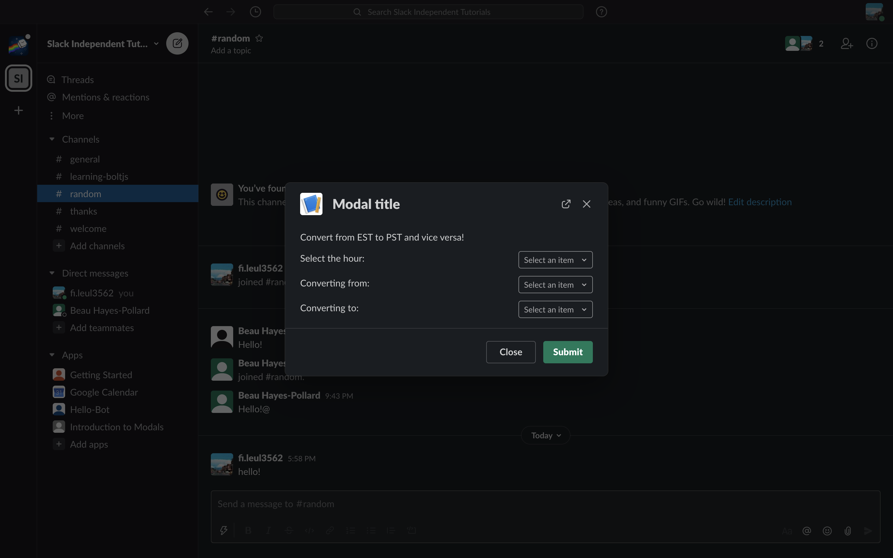

## Time Converter Slack App

#### Use what you learned to create a Time Converter Slack App.

This issue will be a project that uses a slash command, modals, and block kits. Make an app that, when the right slash command is invoked, prompts the user for their timezone and hour and the timezone they would like to convert to. Afterwards, send them a message in the chat with the converted time. 

The shortcut should use selection menus for all of its fields. You should be able to convert from either timezone. You may also use any two timezones that you would like, and write any functions needed to convert from one to another. Refer to the following picture as a reference:

Feel free to reach out to either of your mentors with any questions!

**After you have finished, make sure to commit any file changes you made. To do this, please create a `branch` off of the master called `week(x)` with x being the # of the week you are on. For that week you will need to create a PR for every Learning Lab step to review and make sure your work is correct. For example: After finishing step 1.2, make a new branch off of `week(x)` and call it `week(x)-1.2` (with 1.2 being the step you're on). Then create a `Pull Request` between `week(x)` and `week(x)-1.2`. After reviewing you're PR or having another user review it, merge you're work and continue.**

**REMINDER: If you are part of the MENTORED group, after you complete all steps within a certain week and followed the instructions above, create a `Pull Request` with your work from `week(x)` to `master` and assign your mentor as a reviewer. If you are an open-source user, do the same but self-review your PR to continue to the next week.**
