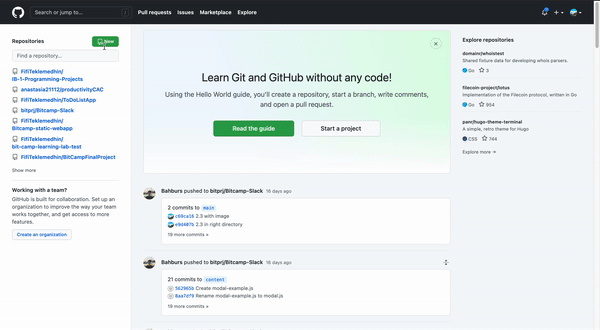
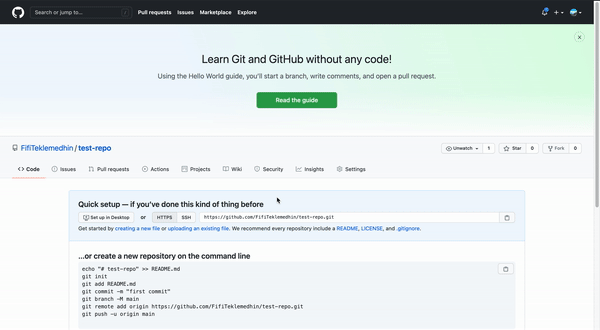

# Week 4 Livestream

Last week, you learned how to work with third party APIs and respond in threads. This week is covers different similar topics.

## 📝 Objectives

### Week 4 Objectives

This week's goals include:

- Understanding and utilizing webhooks
- Understanding and utilizing Express and other frameworks

### Livestream Objectives

The livestream for Week 4 is an introduction to the week's objectives. During the livestream, you will learn how to use GitHub webhooks and handle the payload. For reference, Github is a verison control site that lets you maintain repositories of code across several iterations. It is extremely useful for both personal and proffessional projects. Getting the payload from a webhook will involve using the Express framework. 

The mentor leading the stream teaches these principles through two sample projects. The first is listening for a repository to be starred, then messaging a Slack channel when the event occurs. The second involves listening for the home of an app to be opened, then publishing a view with the event information.

## 🔨 Project 1

Webhooks are applications that send other apps useful information. They are almost the opposite of an API; rather than prompting the third party for data, the third party gives you data when it becomes available.

### Creating Your Own Webhook

If you don't have an account already, create one at www.github.com. You will need a repository, which can be created by pressing the 'create repository' button at the top left of your dashboard:



Once you have created a repository, navigate to the settings page from the dashboard and select 'secrets'. You will need a secret in order to access the repository. Create an arbitrary secret name and value. 




### ⚡️ Set Up

Express is used in to project to handle the payload from a GitHub webhook. After you have finished the regular setup of your app, navigate in your terminal to the directory where it is located. Call ```npm install express ``` and wait for the package to download. Then call ```npm install axios```. You will not need axios for this project, but can use it in the next.

When the dependencies have been installed, open your app.js file in a text editor and paste the following code:

```javascript
const { App, ExpressReceiver } = require('@slack/bolt');
const express = require('express');
const express = require('axios');
const { config } = require('dotenv');

const app = new App({
  token: process.env.SLACK_BOT_TOKEN,
  receiver
});
```

This handles all dependencies and objects needed for a basic app as well as the Express package you downloaded.

### 🔔 Creating an ExpressReceiver

Create an ExpressReceiver object to handle the webhook payload:

```javascript
const receiver = new ExpressReceiver({ signingSecret: process.env.SLACK_SIGNING_SECRET });
receiver.router.use(express.json());
```

This object can be used to invoke the GET and POST functions with the webhook payload. For this project, only the POST function will be used. Make sure to create a channel in the Slack app that your bot has access to.

```javascript
receiver.router.post('/github-stars', async (req, res) => {
  
  await app.client.chat.postMessage({
    token: process.env.SLACK_BOT_TOKEN,
    channel: '<your channel>',
    text,
  });

  res.sendStatus(200);
});

```

This is the basic outline of what the app will do. It will listen on a server for a payload, then formulate some sort of message, then post that text in a channel that the bot is in. The next snippet of code locates the information in the payload then uses it to construct this text:

```javascript
const { action, repository, sender } = req.body;
  const verb = action === 'deleted' ? 'unstarred' : 'starred';
  const text = `${sender.login} just ${verb} the \`${repository.name}\` repository, bringing the total number of stars to ${repository.stargazers_count}.`;
```

> **Note: ** you will have to run a local server in order to receive the payload.

## 🔨 Project 2

> **Note: ** these projects are small enough that you can keep them together, which would save you some time on set up. 

### Outlining the Function

The second project listens for the home of an app to be opened, then publishing a view with the GitHub repository's issue information. This project is encapsulated into one function call. Below is the function signature and body:

```javascript
app.event('app_home_opened', async ({ event, client }) => {
});
```

 This has an event id and some basic information received when the event occurs. The first step in building this app is to get the data from the repository:

```javascript
const GITHUB_REPO_URL = 'https://api.github.com/repos/misscoded/slack-bit-camp';
const { data: issues } = await axios.get(`${GITHUB_REPO_URL}/issues`);
```

### 👷🏻 Creating the View 

Then you will create a map with the object 'issue' that holds the repository information. These pieces of information will be added to the view that is published on your Slack app:

```javascript
const issueBlocks = issues.map(issue => ({
    type: 'section',
    text: {
      type: 'mrkdwn',
      text: `<${issue.html_url}|${issue.title}> opened by <${issue.user.html_url}|${issue.user.login}>`
    },
  }));
```

This organizes the data appropriately to fit the format of a block. The final step will be to actually publish the view. This will send the view to the user who invoked the event:

```javascript
await client.views.publish({
    user_id: event.user,
    view: {
      type: 'home',
      blocks: [
        {
          type: 'header',
          text: {
            type: 'plain_text',
            text: 'Open Issues'
          },
        },
        ...issueBlocks,
      ]
    }
  });

```


And that is all of the content from your final livestream! Reach out to your mentors for any help or questions.


